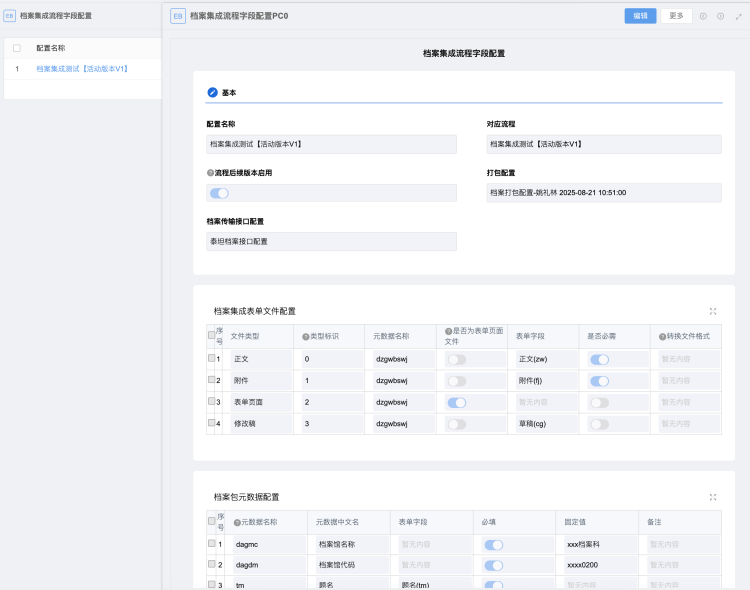
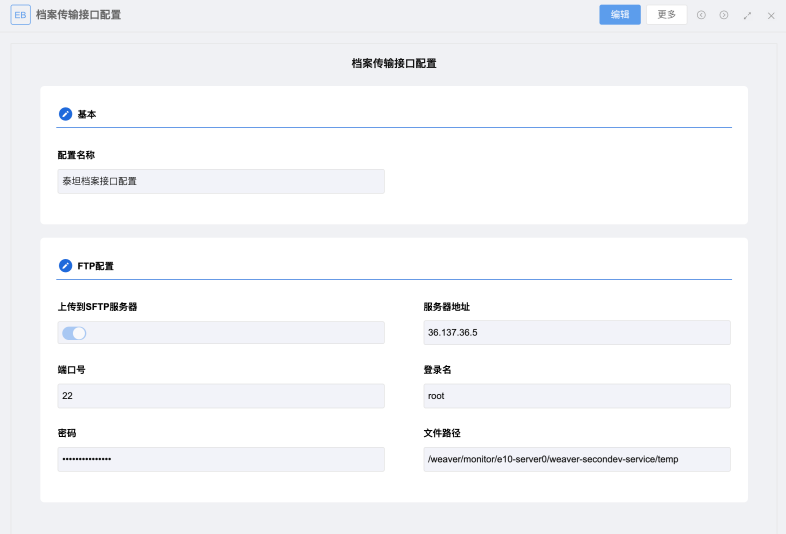
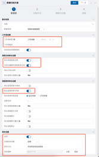
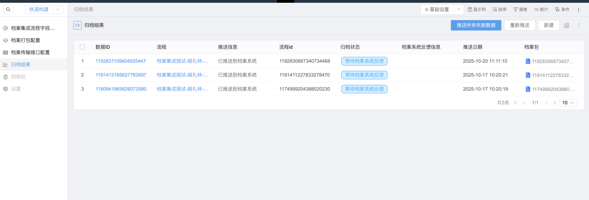

# 档案集成说明

本开发是用于在E10集成泰坦档案，做了配置化的设计，也可以适配其它档案厂商（由于不同厂商存在差异，不保证可以）。

项目特点：
- 高度配置化设计：包含元数据与流程字段映射配置、打包配置、接口配置，通用性强，后期维护简单，无需修改代码，适配所有流程
- 与标准功能集成：采用档案集成中的 e-code 自定义归档方案，档案推送由标准功能触发，档案推送功能由开发实现。
- 使用友好：档案配置可在档案集成标准功能页面配置和 eb 应用中配置，提供详细的操作说明文档，界面设计友好
- 通用化设计：为了可适配其它档案厂商，做了大量可配置化设计，并提供源码可进行修改。

## E10版本要求
建议版本：10.0.2509.01

## 使用方法
### 一、最简单方法 - 使用 jar 包
下载本项目下的 `secondev-hnweaver-ecodeArchive-1.0.0.jar` 包，将它作为外部依赖部署到系统中，另外还需要引入二开公共类库，
地址：https://github.com/YaoLilin/weaver-e10-second-dev-common ，下载公共类库的 jar 包，将它作为外部依赖部署到系统中。

### 二、将源码放入你的二开项目
本项目为泛微 E10 二次开发，需要自行搭建二次开发环境，下载本项目后将代码放入你的开发项目中，建议放入一个模块，打包时将该模块代码
合并到你的 jar 包中。  
需要添加 freemarker 依赖，gradle 依赖配置：
```
implementation("org.freemarker:freemarker:2.3.34")
```
还需引入二开公共类库，将此类库，地址：https://github.com/YaoLilin/weaver-e10-second-dev-common ，将此项目的源码放入
到你的项目中，或下载公共类库的 jar 包，将此 jar 包引入到你的项目。

## 功能
### 配置功能
#### 档案集成流程字段配置


- 可配置档案包元数据，可选择流程表单字段进行取值（可在归档方案中映射与过滤配置转换，对字段值进行转换），可进行必填校验
- 可配置文件从流程字段中获取，比如正文、附件、表单页面文件，这些文件将会放入档案包中，并在元数据 xml 文件内生成文件信息。
  - 可按需配置获取文件，比如只需要获取正文，则只添加正文配置即可
  - 可配置文件类型转换，比如 docx 转 pdf（需集成 WPS）
  - 文件类型可自定义，文件类型是一个选择框，可以在该 EB 表单中修改选项内容，或者添加选项，比如将正文修改为其它名称，添加新的文件类型
- 支持对后续版本流程生效，启用后后面流程由新增版本，无需再对次流程版本进行配置

#### 档案打包配置

- 可对档案包内的 xml文件名称和路径进行配置
- 可配置 xml 文件的模板，xml 文件将按模板进行生成，并将数据注入到模板中（使用 freemarker 生成）
- 可对每个文件类型配置文件在档案包内的存放路径

#### 档案传输接口配置

可配置 FTP 服务器信息，档案包将上传到此 FTP 服务器的对应路径内（没有调用接口，因为泰坦档案只需要上传到 FTP 即可）

#### 归档方案配置
可在标准功能的档案集成 -》归档方案设置中添加归档方案，数据源中选择需要推送的流程，归档方式选择 e-code 自定义归档，映射与过滤中可配置字段转换。

只有配置归档方案才会执行档案推送，档案定时推送与档案推送日志由标准功能进行。


### 档案推送结果台账
在台账中可查看所有的档案推送记录，可查看推送结果，并可进行重新推送。


### 档案系统归档结果异步反馈
档案系统需调用 OA 接口反馈归档结果，反馈的结果会更新到归档结果台中。
OA 接口地址：`/papi/secondev/hnweaver/integration/archive` ，注意此接口无需认证就可调用。

## 部署与配置
请查看开发包内的部署文档和操作文档
